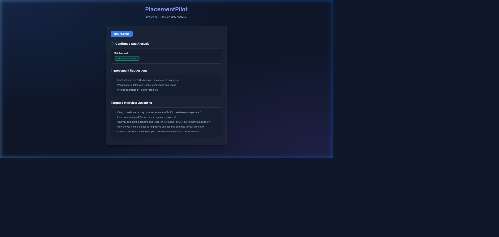
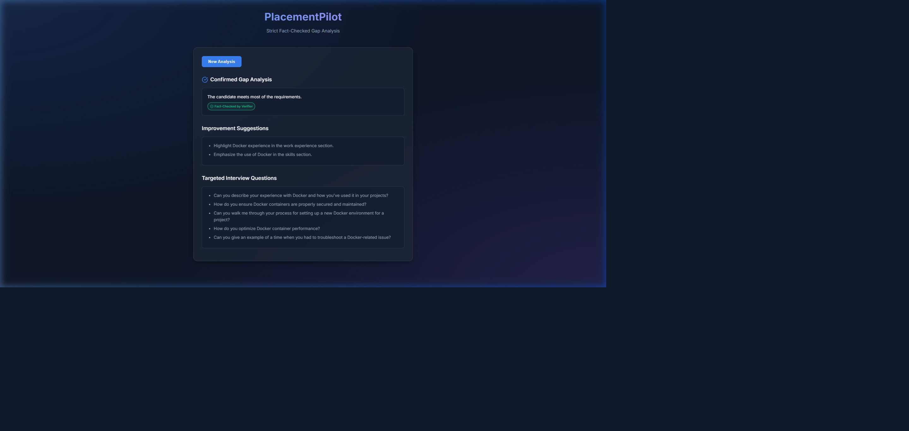
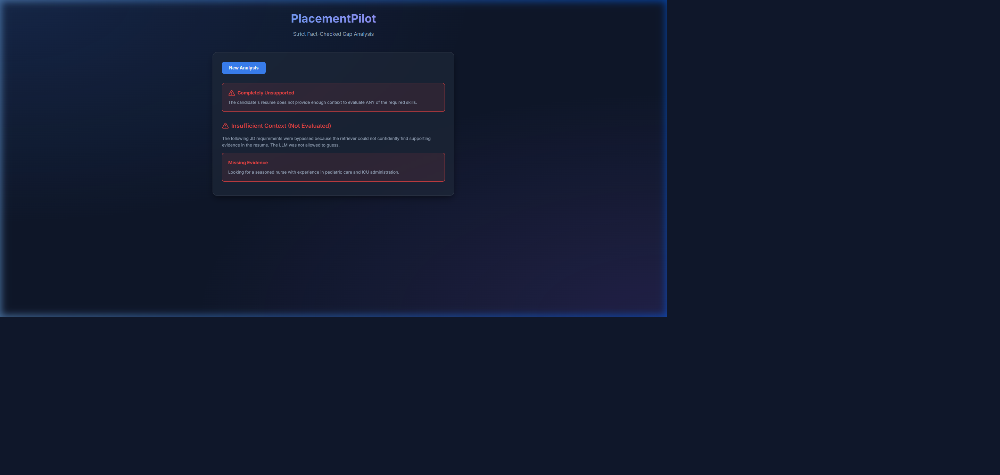

# Phase 6 Execution Walkthrough

The backend pipeline is now completely integrated and tested for the edge cases requested. Here's a breakdown of the finalized additions:

## 2. Unsupported Requirements Field

> [!TIP]
> The `unsupported_requirements` field is explicitly integrated throughout the stack.

- **Schemas**: It is fully defined in [`AnalysisResponse`](file:///C:/Users/anujr/OneDrive/Desktop/PlacementPilot/backend/schemas.py#L15) as `Optional[List[str]] = None`.
- **Database Model**: It is mapped in [`db/models.py`](file:///C:/Users/anujr/OneDrive/Desktop/PlacementPilot/backend/db/models.py#L23) as a `JSON` column.
- **Pipeline Logic**: During the retrieval phase in [`main.py`](file:///C:/Users/anujr/OneDrive/Desktop/PlacementPilot/backend/main.py#L141), any JD chunk that falls below the threshold or fails retrieval is cleanly appended to the `unsupported_requirements` list.

## 3. The "Full Mismatch" Short-Circuit

We've finalized the logic to handle cases where *no* JD requirements meet the confidence threshold against the candidate's resume:

```python
    # 6. Generation & Verification
    if not gradeable_jd_texts:
        # Fast path refusal if zero chunks met confidence
        gap_summary = GroundedGenerator.REFUSAL_STRING
        improvements = []
        questions = []
        is_flagged = False
```
This guarantees we skip calling the LLM Generation layer, directly yielding the standard refusal string and saving on compute.

### Test Verification

To prevent regressions against Rule 4 (Retrieval confidence gates generation), I added a new full-integration test case:

- **[`test_pipeline_integration.py`](file:///C:/Users/anujr/OneDrive/Desktop/PlacementPilot/backend/tests/test_pipeline_integration.py)**: A new integration test suite was created utilizing FastAPI's `TestClient`. It mocks the internal DB and retrieval dependencies, strictly validating that when all retrieval scores fail the confidence threshold, the endpoint returns a `200 OK` filled with the default refusal string while making **zero** calls to the LLM generator.

The test `test_full_mismatch_short_circuit` has successfully passed against the Phase 6 pipeline. We are officially ready to wrap up this backend phase.

## 4. Frontend Demo Complete

The full frontend implementation is complete and verified to work. A browser subagent successfully ran through the three required scenarios as mandated in `PHASES.md §6` directly on the local React app.

### Confident Match
When the resume provides sufficient supporting context, the gap analysis succeeds and generates the `Fact-Checked by Verifier` badge.


### Partial Mismatch (Resume with Gaps)
When some required skills are missing but the resume generally matches the role, it generates actionable gap analysis and flags the discrepancy.


### Full Mismatch (Short-Circuit Refusal)
When all JD chunks fall below the retrieval confidence threshold, the short-circuit condition triggers properly. The generation step is bypassed completely to prevent hallucination, displaying a refusal block.


### Subagent Recording
The full interactive browser session verifying these three UI states was successfully captured.

